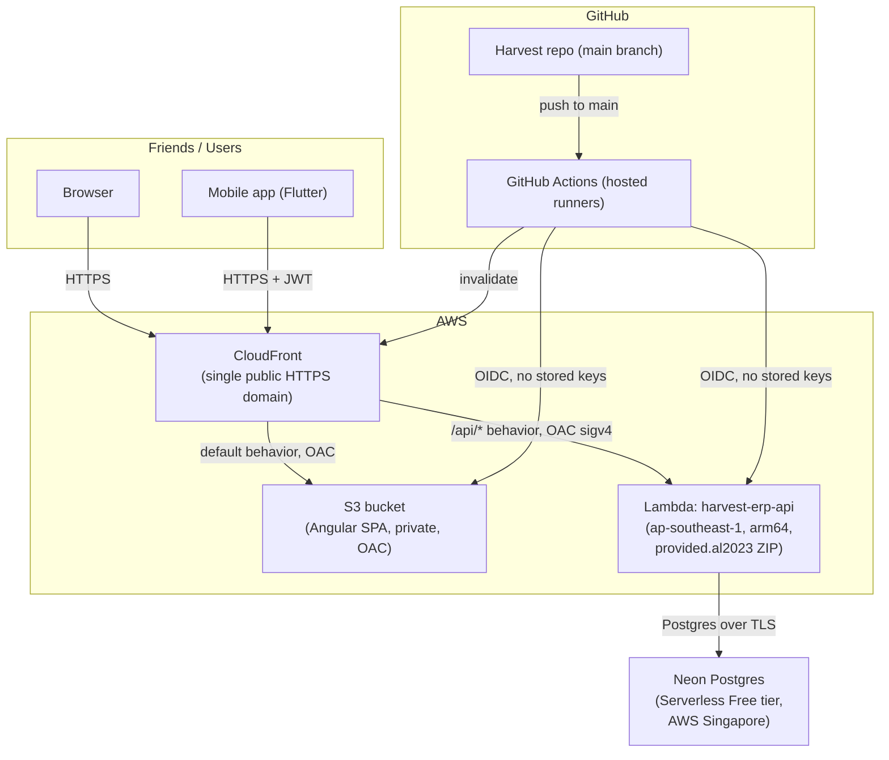

# Fruit Wholesale Management System

A production-ready ERP for a fruit wholesale business: supply/purchase invoicing, customer collections, supplier payments, daily expenses, and fully automatic double-entry-style ledgers (Shop, Supplier, Cash), built on Clean Architecture with ASP.NET Core and Angular.

## Technology Stack

| Layer | Technology |
|---|---|
| Backend API | ASP.NET Core **10** Web API (see note below), C# |
| Data access | Dapper + Npgsql (no ORM) |
| Database | PostgreSQL |
| Auth | JWT Bearer |
| Validation | FluentValidation (via a global MVC action filter) |
| Mapping | AutoMapper |
| Logging | Serilog (console + rolling file sink) |
| API docs | Swagger / Swashbuckle |
| Frontend | Angular 20 (standalone components, signals, new control-flow syntax) |
| UI kit | Angular Material 3 only — minimalist M3 design, no Bootstrap dependency |
| Charts | Chart.js (via a small wrapper component) |
| Export | SheetJS (xlsx) + jsPDF/autoTable |

> **Note on version:** the spec calls for ASP.NET Core 9, but this machine only has the **.NET 10 SDK** installed (no .NET 9 runtime). The solution targets **net10.0** so it actually runs here. To retarget to net9.0, install the .NET 9 SDK and change `<TargetFramework>` in each `.csproj`, plus `FruitWholesale.Client`'s Angular version is unaffected.

## Solution Structure

```
FruitWholesale.slnx
src/
  FruitWholesale.Domain/          Entities, domain enums/constants — no dependencies
  FruitWholesale.Shared/          Result<T> pattern, PaginatedList<T>, shared exceptions
  FruitWholesale.Application/     DTOs, service interfaces + implementations, FluentValidation
                                   validators, AutoMapper profile, repository interfaces
  FruitWholesale.Infrastructure/  Dapper repository implementations, LedgerService (the
                                   ledger-synchronization engine), JWT token issuing
  FruitWholesale.Api/             Controllers, Program.cs (DI/auth/Swagger/Serilog wiring),
                                   global exception handler, validation filter
FruitWholesale.Client/            Angular 20 SPA
  src/app/core/                   models, services (auth/theme/notification/export),
                                   interceptors, guards
  src/app/layout/                 collapsible sidenav + toolbar shell
  src/app/auth/                   login
  src/app/shared/                 confirm-dialog, Chart.js wrapper
  src/app/features/               one folder per module (dashboard, shop-master,
                                   supplier-master, fruit-master, expense-category,
                                   route-master, employee, employee-work-log, stock,
                                   supply, purchase, collection, supplier-payment,
                                   daily-expense, ledgers, reports, users, settings)
database/
  01_CreateDatabase_Tables.sql    Idempotent — drops/recreates everything in dependency order
  02_Indexes.sql                  Idempotent (DROP INDEX IF EXISTS then CREATE)
  03_StoredProcedures.sql         Ledger recalculation procs (incl. stock) + dashboard summary proc
  04_SeedData.sql                 Admin login only
  05_ClearData.sql                Standalone reset — wipes all data except the admin login
```

Dependency direction is strictly inward: `Api → Infrastructure → Application → Domain/Shared`. `Application` only references abstractions (`IDbConnectionFactory`, repository interfaces); `Infrastructure` provides the Dapper-backed implementations.

## Ledger Synchronization Design

This is the core business rule of the whole system, so it's worth explaining how it's implemented:

- **`ILedgerService`** (`Application/Common/Interfaces`, implemented in `Infrastructure/Services/LedgerService.cs`) is the only code path allowed to write to `ShopLedger`, `SupplierLedger`, and `CashLedger`.
- Every transactional repository (`SupplyRepository`, `PurchaseRepository`, `CollectionRepository`, `SupplierPaymentRepository`, `DailyExpenseRepository`, and the master-data repositories for opening balances) opens **one SQL transaction**, writes its own table(s), calls `ILedgerService` to add/remove the matching ledger row(s) inside that same transaction, then calls the matching `sp_recalculate_*_ledger_balance` PL/pgSQL function before committing.
- Recalculation (not just appending a running total) is what makes backdated entries, edits, and deletes correct — the functions re-derive `RunningBalance` for every row of the affected shop/supplier (or the whole cash ledger) in one set-based pass, in `(TransactionDate, LedgerID)` order.
- Opening balances (`ShopMaster.OpeningBalance`, `SupplierMaster.OpeningBalance`, `CompanySettings.OpeningCashBalance`) are booked as their own `OpeningBalance`-type ledger row at creation time — never added a second time by the recalculation functions (an earlier bug during development double-counted this; see the functions for the fix and comment explaining why they sum from zero).
- The only way to touch `CashLedger` outside of an automatic transaction is `POST /api/companysettings/cash-adjustment` (Admin/Accountant only), which books an explicit `Adjustment` row — this matches the business rule "CashLedger must never be edited manually except Opening Balance and Cash Adjustment."
- The same pattern extends to stock: `StockLedger` tracks fruit quantity, with `sp_recalculate_stock_ledger_balance` recomputing `RunningStock` the same way. Every Purchase item books `QuantityIn`, every Supply item books `QuantityOut`, both inside the existing Purchase/Supply transaction — so stock, the supplier/shop ledger, and the source document always commit or roll back together. `POST /api/stock/adjustment` (Admin/Manager only) is the manual-correction escape hatch, mirroring Cash Adjustment.

## Routes, Employees & Stock

- **RouteMaster** groups shops into delivery routes — a wholesaler can run more than one. `ShopMaster.RouteID` is a nullable FK; assign a shop to a route from the Shop form or leave it unassigned.
- **EmployeeMaster** is deliberately a plain staff directory (name, phone, address) — employees have no fixed route or fixed working days, since in practice who goes where changes day to day.
- **EmployeeWorkLog** (`/employee-salary` in the app) is where that variability is actually recorded: one row per day an employee did paid work, with a `JobType` (`Supply`, `Collection`, `Loading`, `Other`), an optional `RouteID` (only relevant for Supply/Collection — the form hides the route picker for Loading/Other), an `Amount`, and a `PaymentMode`. Every entry with `Amount > 0` books a `CashLedger` "Cash Out" entry inside the same transaction, exactly like `DailyExpense` — edits and deletes reverse and re-book automatically.
- **Stock** (`/stock` in the app) shows current on-hand quantity per fruit, computed from the latest `StockLedger` row per `FruitID`, with a drill-down ledger view and a manual adjustment dialog.

## Getting Started

### 1. Database

Requires a local or reachable PostgreSQL instance. Create the database first (`createdb FruitWholesaleDB` or `CREATE DATABASE "FruitWholesaleDB";` from `psql`), then run the bootstrap scripts against it:

```bash
cd database
psql -U postgres -h localhost -d FruitWholesaleDB -f 01_CreateDatabase_Tables.sql
psql -U postgres -h localhost -d FruitWholesaleDB -f 02_Indexes.sql
psql -U postgres -h localhost -d FruitWholesaleDB -f 03_StoredProcedures.sql
psql -U postgres -h localhost -d FruitWholesaleDB -f 04_SeedData.sql
```

All scripts are idempotent — re-running them drops and recreates cleanly. `04_SeedData.sql` seeds **only the admin login** — no demo company profile, fruits, or expense categories; add those yourself once you're logged in. `05_ClearData.sql` is a standalone reset: run it any time to wipe every table back to empty except the admin user, without dropping/recreating the schema.

Everything after this initial bootstrap (`06_*.sql` onward) is historical record from the SQL Server era and predates the Postgres port — see [Database Migrations](#database-migrations) under Deployment for how new migrations are added going forward (currently just `26_AddRefreshTokens.sql`, applied automatically by `MigrationRunner` on API startup).

Update `src/FruitWholesale.Api/appsettings.json` → `ConnectionStrings:DefaultConnection` if your Postgres instance isn't `localhost:5432` with user `postgres`/password `postgres`.

### 2. Backend API

The JWT signing secret is **not** in `appsettings.json` — it is supplied at runtime so it never
reaches source control. Set your local one once, before the first run:

```bash
cd src/FruitWholesale.Api
dotnet user-secrets set "Jwt:Secret" "$(openssl rand -base64 64 | tr -d '\n')"
```

Then:

```bash
dotnet build FruitWholesale.slnx
dotnet run --project src/FruitWholesale.Api/FruitWholesale.Api.csproj --urls http://localhost:5080
```

Swagger UI: http://localhost:5080/swagger

**Default login:** `admin` / `Admin@123` (change it from Settings → Change Password after first login).

> Startup fails with a clear message if the secret is missing or shorter than 32 bytes. Deployed
> environments supply it as the `Jwt__Secret` environment variable (set on the Lambda, not in the
> repo). Rotating it invalidates every issued token, so all users are signed out.

### 3. Frontend

```bash
cd FruitWholesale.Client
npm install
npm run start
```

App: http://localhost:4200 — configured (`src/environments/environment.ts`) to call the API at `http://localhost:5080/api`.

## Deployment

The app runs entirely on **AWS**, on always-free / free-tier services: the frontend on **S3 + CloudFront**, the API on **AWS Lambda**, and the database on **Neon** (managed serverless Postgres, hosted in AWS). The whole stack sits behind a single CloudFront domain, so the browser talks to one origin for both the app and the API.

> **History:** the app previously ran on Azure (Container Apps + Azure SQL). It was migrated to AWS in August 2026 after Azure SQL's free-tier compute cap kept auto-pausing the database mid-month; see [Migration Log](#migration-log-azure--aws). The Azure-era code is preserved on the `dev` branch.

### Architecture



- **Frontend** — Angular production build in a **private** S3 bucket; CloudFront reaches it through an **Origin Access Control** (the bucket is never public) and serves it over HTTPS. SPA deep-links/refreshes are handled by a `403/404 → /index.html` rule.
- **Backend** — ASP.NET Core API on **AWS Lambda** (`harvest-erp-api`, Singapore `ap-southeast-1`, `arm64`). Because .NET 10 isn't a managed Lambda runtime yet, it ships as a **self-contained ZIP on the `provided.al2023` custom runtime** (the .NET runtime is bundled; the published apphost is renamed to `bootstrap`, which the custom runtime invokes — see the `RenameApphostToBootstrap` target in `FruitWholesale.Api.csproj`). The function is exposed by a **Lambda Function URL** with auth type `AWS_IAM` — it is **not public**. CloudFront reaches it as a second origin under the `/api/*` behavior, signing every request with an **OAC (sigv4)**. Because the app and API share the CloudFront domain, the browser makes same-origin calls and no CORS is involved.
- **Database** — **Neon** serverless Postgres (Free tier, AWS Singapore, co-located with the Lambda): 0.5 GB storage, 100 compute-hours/month, autosuspends when idle. The connection string is a Lambda **environment variable** (`ConnectionStrings__DefaultConnection`), never committed. `MigrationRunner` opens the connection with retry/backoff so a suspended DB waking on the first request after idle doesn't crash startup.
- **CI/CD** — GitHub Actions authenticating to AWS via **OIDC** (role `harvest-github-deploy`; no long-lived AWS keys stored in GitHub). `pr-checks.yml` runs a compile-only build check on PRs to `main`. `deploy-api.yml` deploys the Lambda (`dotnet lambda deploy-function`) and `deploy-web.yml` builds the SPA, syncs it to S3, and invalidates CloudFront — each on pushes to `main` that touch its part of the tree (path-filtered), or on demand via **Run workflow**.

### Database Migrations

Schema changes after the initial `01`–`04` bootstrap are applied **automatically by the API on startup**, not by a CI step — keeping migrations on the same trusted DB connection the app already uses, with no separate credential or pipeline to maintain.

**How it works:** `MigrationRunner` (`src/FruitWholesale.Infrastructure/Persistence/MigrationRunner.cs`) runs before the app serves requests (`Program.cs`, right after `builder.Build()`). It reads `database/auto-migrations.txt` — an **explicit, ordered allowlist** — and for each script listed, checks a `SchemaMigrations` journal table: anything not yet recorded is applied and recorded; anything already there is skipped. A Postgres **advisory lock** guards against two cold-starting instances racing on the same migration. The initial connection retries with backoff, since a serverless DB can take longer than a plain connection timeout to wake from autosuspend — and since this runs before the app can serve anything, a suspended DB on the first request after a deploy must not crash startup.

**Why an explicit allowlist, not "every script numbered ≥6":** the `database/` folder also holds one-time bootstrap scripts (`01`–`05`; `01_CreateDatabase_Tables.sql` drops and recreates every table) and manual reset/catch-up tools (`11_ClearTransactionalData.sql` deletes all transactional/ledger data with **no idempotency guard**) that must never run automatically. A script runs only if its filename is explicitly listed in `auto-migrations.txt`, regardless of its number — a deliberate guard so a destructive script can never auto-apply just by being merged.

**To add a new migration:**
1. Write `database/NN_Description.sql` — guard every change with `IF NOT EXISTS`/`IF EXISTS` so it's safe to re-run.
2. Add `NN_Description.sql` on its own line in `database/auto-migrations.txt`.
3. Commit both and merge to `main`. The scripts are bundled into the Lambda ZIP, so the API applies the new migration (and records it in `SchemaMigrations`) the next time it starts.

**Never add to the manifest:** anything that deletes data unconditionally, or a one-time bootstrap/catch-up script.

### Cost

Everything runs on **always-free / free-tier** AWS services plus Neon's free tier:

| Resource | Free allowance | If exceeded |
|---|---|---|
| Lambda (API) | **1,000,000 requests + 400,000 GB-seconds / month**, always free | ~$0.20 per additional 1M requests — far beyond this app's volume |
| S3 (frontend hosting) | A few MB of static assets; request/storage cost negligible | Fractions of a cent |
| CloudFront | **1 TB data-out + 10M requests / month**, always free | Pennies per additional GB |
| Neon Postgres | **0.5 GB storage + 100 compute-hours / month** (autosuspends when idle) | Storage needs a paid tier to grow past; compute-hours reset monthly |
| GitHub Actions (private repo) | **2,000 minutes / month** on Linux runners | Bills to the repo owner past the free minutes — our deploys are ~1–2 min each |

There are no VPC/NAT resources (the Lambda reaches Neon over the public internet with TLS), so there's no hidden hourly networking charge. A **$1 "zero-spend" budget alarm** on the AWS account emails on the first cent of actual spend as a safety net.

**Practical tradeoff:** both the Lambda and Neon scale/suspend to zero when idle, so the first request after a quiet period pays a **cold start** (a few seconds for the Lambda, plus up to a few seconds for Neon to resume) — expected, not a bug.

### Migration Log: Azure → AWS

Migrated from Azure to AWS in **August 2026**. The trigger was Azure SQL's serverless free-limit tier: its ~100,000 vCore-seconds/month compute cap kept getting exhausted, auto-pausing the production database mid-month and taking the app down until the next billing cycle.

**What changed**
- **Database** — Azure SQL → **Neon Postgres**. The SQL Server T-SQL (stored procedures, `Microsoft.Data.SqlClient`) was ported to PL/pgSQL + **Npgsql**; the ledger recalculation procs became PL/pgSQL functions. Production data was moved via a `pg_dump`/restore of a locally-migrated copy.
- **Backend** — Azure Container Apps (Docker image) → **AWS Lambda** (self-contained ZIP on `provided.al2023`). Two runtime fixes were needed: rename the published apphost to `bootstrap` (custom-runtime entrypoint), and enable `<InvariantGlobalization>` since the al2023 runtime ships no libicu (see [Troubleshooting](#troubleshooting)).
- **Frontend** — Azure Static Web Apps → **S3 + CloudFront**. The API was folded under the same CloudFront domain (`/api/*` via OAC), so the SPA now makes same-origin API calls.
- **CI/CD** — the Azure `deploy.yml` (GHCR image build → `az containerapp update`; Static Web Apps token) was replaced by `deploy-api.yml` + `deploy-web.yml`, authenticating to AWS via OIDC.
- The Azure-era code is preserved on the **`dev` branch**; the Azure resources can be decommissioned once the AWS stack is confirmed stable.

**Access — try it yourself**
- Web app: **https://d1303bxd595i6l.cloudfront.net**
- Login: `admin` / `Admin@123` (seeded default — use the current password if it's been changed).
- First request after idle may take a few seconds while the Lambda and/or Neon wake from suspend — expected.

### Troubleshooting

**Lambda returns `Runtime.InvalidEntrypoint` / "empty entrypoint"**
The `provided.al2023` custom runtime looks for an executable named `bootstrap` at the package root, but a .NET self-contained publish produces `FruitWholesale.Api` instead. Fix: the `RenameApphostToBootstrap` MSBuild target (in `FruitWholesale.Api.csproj`) renames the apphost to `bootstrap` on the self-contained RID publish; it still loads `FruitWholesale.Api.dll` beside it.

**Lambda `FailFast`s on startup: "Couldn't find a valid ICU package installed on the system"**
The al2023 runtime doesn't ship libicu, and .NET needs it for globalization by default. Fix: `<InvariantGlobalization>true</InvariantGlobalization>` in `FruitWholesale.Api.csproj` — the app runs culture-invariant, which is safe for this JSON API (no culture-specific parsing/formatting).

**Public Function URL / CloudFront returns `403 Forbidden` on a brand-new AWS account**
A newly created AWS account blocks resource-policy-based access to Lambda Function URLs (both anonymous *and* CloudFront's OAC service principal) for the first hours as an anti-abuse measure — even with a correct resource policy. The account owner's own IAM-signed requests still work, so the function is healthy. It clears once the account finishes activating; no config change is needed and access starts working on its own.


## Modules

Dashboard · Users (Admin) · Shop Management · Supplier Management · Fruit Master · Routes · Employees · Employee Salary · Stock · Supply · Purchase · Collections · Supplier Payments · Expense Category · Daily Expenses · Shop Ledger · Supplier Ledger · Cash Ledger · Reports (Daily Sales, Daily Collection, Daily Expense, Purchase, Fruit Sales, Outstanding, Profit Summary) · Settings (Company Profile, Change Password, Cash Adjustment) · Authentication

## Roles

`Admin`, `Manager`, `Accountant`, `Staff`. Only `Admin` can manage Users; Cash Adjustment is restricted to `Admin`/`Accountant`. All other endpoints require authentication but not a specific role — tighten `[Authorize(Roles = ...)]` on `Api/Controllers/*` as your operational policy requires.

## Known Limitations / Follow-ups

- No automated test project yet (unit/integration tests for `LedgerService` and the repositories would be the highest-value addition given how much correctness depends on that code path).
- Angular route guards check role client-side for UI purposes only; the API's `[Authorize(Roles=...)]` attributes are the actual enforcement boundary.
