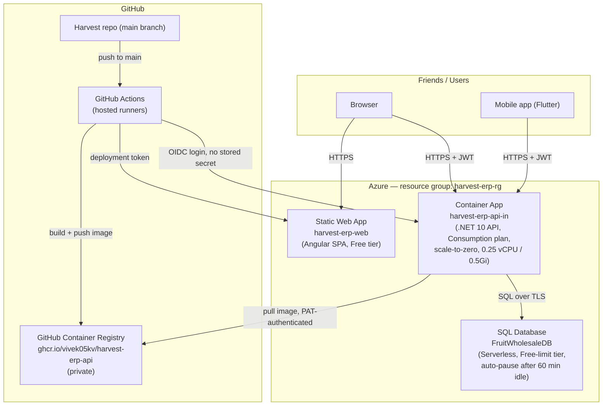

# Fruit Wholesale Management System

A production-ready ERP for a fruit wholesale business: supply/purchase invoicing, customer collections, supplier payments, daily expenses, and fully automatic double-entry-style ledgers (Shop, Supplier, Cash), built on Clean Architecture with ASP.NET Core and Angular.

## Technology Stack

| Layer | Technology |
|---|---|
| Backend API | ASP.NET Core **10** Web API (see note below), C# |
| Data access | Dapper + Npgsql (no ORM) |
| Database | PostgreSQL |
| Auth | JWT Bearer |
| Validation | FluentValidation (via a global MVC action filter) |
| Mapping | AutoMapper |
| Logging | Serilog (console + rolling file sink) |
| API docs | Swagger / Swashbuckle |
| Frontend | Angular 20 (standalone components, signals, new control-flow syntax) |
| UI kit | Angular Material 3 only — minimalist M3 design, no Bootstrap dependency |
| Charts | Chart.js (via a small wrapper component) |
| Export | SheetJS (xlsx) + jsPDF/autoTable |

> **Note on version:** the spec calls for ASP.NET Core 9, but this machine only has the **.NET 10 SDK** installed (no .NET 9 runtime). The solution targets **net10.0** so it actually runs here. To retarget to net9.0, install the .NET 9 SDK and change `<TargetFramework>` in each `.csproj`, plus `FruitWholesale.Client`'s Angular version is unaffected.

## Solution Structure

```
FruitWholesale.slnx
src/
  FruitWholesale.Domain/          Entities, domain enums/constants — no dependencies
  FruitWholesale.Shared/          Result<T> pattern, PaginatedList<T>, shared exceptions
  FruitWholesale.Application/     DTOs, service interfaces + implementations, FluentValidation
                                   validators, AutoMapper profile, repository interfaces
  FruitWholesale.Infrastructure/  Dapper repository implementations, LedgerService (the
                                   ledger-synchronization engine), JWT token issuing
  FruitWholesale.Api/             Controllers, Program.cs (DI/auth/Swagger/Serilog wiring),
                                   global exception handler, validation filter
FruitWholesale.Client/            Angular 20 SPA
  src/app/core/                   models, services (auth/theme/notification/export),
                                   interceptors, guards
  src/app/layout/                 collapsible sidenav + toolbar shell
  src/app/auth/                   login
  src/app/shared/                 confirm-dialog, Chart.js wrapper
  src/app/features/               one folder per module (dashboard, shop-master,
                                   supplier-master, fruit-master, expense-category,
                                   route-master, employee, employee-work-log, stock,
                                   supply, purchase, collection, supplier-payment,
                                   daily-expense, ledgers, reports, users, settings)
database/
  01_CreateDatabase_Tables.sql    Idempotent — drops/recreates everything in dependency order
  02_Indexes.sql                  Idempotent (DROP INDEX IF EXISTS then CREATE)
  03_StoredProcedures.sql         Ledger recalculation procs (incl. stock) + dashboard summary proc
  04_SeedData.sql                 Admin login only
  05_ClearData.sql                Standalone reset — wipes all data except the admin login
```

Dependency direction is strictly inward: `Api → Infrastructure → Application → Domain/Shared`. `Application` only references abstractions (`IDbConnectionFactory`, repository interfaces); `Infrastructure` provides the Dapper-backed implementations.

## Ledger Synchronization Design

This is the core business rule of the whole system, so it's worth explaining how it's implemented:

- **`ILedgerService`** (`Application/Common/Interfaces`, implemented in `Infrastructure/Services/LedgerService.cs`) is the only code path allowed to write to `ShopLedger`, `SupplierLedger`, and `CashLedger`.
- Every transactional repository (`SupplyRepository`, `PurchaseRepository`, `CollectionRepository`, `SupplierPaymentRepository`, `DailyExpenseRepository`, and the master-data repositories for opening balances) opens **one SQL transaction**, writes its own table(s), calls `ILedgerService` to add/remove the matching ledger row(s) inside that same transaction, then calls the matching `sp_recalculate_*_ledger_balance` PL/pgSQL function before committing.
- Recalculation (not just appending a running total) is what makes backdated entries, edits, and deletes correct — the functions re-derive `RunningBalance` for every row of the affected shop/supplier (or the whole cash ledger) in one set-based pass, in `(TransactionDate, LedgerID)` order.
- Opening balances (`ShopMaster.OpeningBalance`, `SupplierMaster.OpeningBalance`, `CompanySettings.OpeningCashBalance`) are booked as their own `OpeningBalance`-type ledger row at creation time — never added a second time by the recalculation functions (an earlier bug during development double-counted this; see the functions for the fix and comment explaining why they sum from zero).
- The only way to touch `CashLedger` outside of an automatic transaction is `POST /api/companysettings/cash-adjustment` (Admin/Accountant only), which books an explicit `Adjustment` row — this matches the business rule "CashLedger must never be edited manually except Opening Balance and Cash Adjustment."
- The same pattern extends to stock: `StockLedger` tracks fruit quantity, with `sp_recalculate_stock_ledger_balance` recomputing `RunningStock` the same way. Every Purchase item books `QuantityIn`, every Supply item books `QuantityOut`, both inside the existing Purchase/Supply transaction — so stock, the supplier/shop ledger, and the source document always commit or roll back together. `POST /api/stock/adjustment` (Admin/Manager only) is the manual-correction escape hatch, mirroring Cash Adjustment.

## Routes, Employees & Stock

- **RouteMaster** groups shops into delivery routes — a wholesaler can run more than one. `ShopMaster.RouteID` is a nullable FK; assign a shop to a route from the Shop form or leave it unassigned.
- **EmployeeMaster** is deliberately a plain staff directory (name, phone, address) — employees have no fixed route or fixed working days, since in practice who goes where changes day to day.
- **EmployeeWorkLog** (`/employee-salary` in the app) is where that variability is actually recorded: one row per day an employee did paid work, with a `JobType` (`Supply`, `Collection`, `Loading`, `Other`), an optional `RouteID` (only relevant for Supply/Collection — the form hides the route picker for Loading/Other), an `Amount`, and a `PaymentMode`. Every entry with `Amount > 0` books a `CashLedger` "Cash Out" entry inside the same transaction, exactly like `DailyExpense` — edits and deletes reverse and re-book automatically.
- **Stock** (`/stock` in the app) shows current on-hand quantity per fruit, computed from the latest `StockLedger` row per `FruitID`, with a drill-down ledger view and a manual adjustment dialog.

## Getting Started

### 1. Database

Requires a local or reachable PostgreSQL instance. Create the database first (`createdb FruitWholesaleDB` or `CREATE DATABASE "FruitWholesaleDB";` from `psql`), then run the bootstrap scripts against it:

```bash
cd database
psql -U postgres -h localhost -d FruitWholesaleDB -f 01_CreateDatabase_Tables.sql
psql -U postgres -h localhost -d FruitWholesaleDB -f 02_Indexes.sql
psql -U postgres -h localhost -d FruitWholesaleDB -f 03_StoredProcedures.sql
psql -U postgres -h localhost -d FruitWholesaleDB -f 04_SeedData.sql
```

All scripts are idempotent — re-running them drops and recreates cleanly. `04_SeedData.sql` seeds **only the admin login** — no demo company profile, fruits, or expense categories; add those yourself once you're logged in. `05_ClearData.sql` is a standalone reset: run it any time to wipe every table back to empty except the admin user, without dropping/recreating the schema.

Everything after this initial bootstrap (`06_*.sql` onward) is historical record from the SQL Server era and predates the Postgres port — see [Database Migrations](#database-migrations) under Deployment for how new migrations are added going forward (currently just `26_AddRefreshTokens.sql`, applied automatically by `MigrationRunner` on API startup).

Update `src/FruitWholesale.Api/appsettings.json` → `ConnectionStrings:DefaultConnection` if your Postgres instance isn't `localhost:5432` with user `postgres`/password `postgres`.

### 2. Backend API

```bash
dotnet build FruitWholesale.slnx
dotnet run --project src/FruitWholesale.Api/FruitWholesale.Api.csproj --urls http://localhost:5080
```

Swagger UI: http://localhost:5080/swagger

**Default login:** `admin` / `Admin@123` (change it from Settings → Change Password after first login).

> The JWT signing secret in `appsettings.json` is a real random value generated for this environment — rotate it before any real deployment, and never commit production secrets.

### 3. Frontend

```bash
cd FruitWholesale.Client
npm install
npm run start
```

App: http://localhost:4200 — configured (`src/environments/environment.ts`) to call the API at `http://localhost:5080/api`.

## Deployment

The app is hosted on **Azure**, chosen mainly because it's a native fit for the stack already in use — the backend is ASP.NET Core and the ledger engine leans heavily on SQL Server-specific T-SQL (stored procedures, `USE`, `sp_Recalculate*` procs), so swapping the database engine for a cheaper Postgres/MySQL managed tier wasn't a realistic option without rewriting the ledger layer. Azure also happens to offer genuine free tiers for every layer of this stack (compute, database, static hosting), which is what actually made "free" achievable end to end.

### Architecture



- **Frontend** — Angular production build, deployed to Azure Static Web Apps. `staticwebapp.config.json` adds a navigation fallback so deep-links/refreshes on client-side routes (e.g. `/dashboard`) don't 404.
- **Backend** — ASP.NET Core API, containerized (multi-stage `src/FruitWholesale.Api/Dockerfile`, Alpine-based runtime, ~216MB image) and deployed to **Azure Container Apps** (Consumption plan, scale-to-zero). CI builds the image and pushes it to **GitHub Container Registry** (`ghcr.io/vivek05kv/harvest-erp-api`, public — after a fine-grained PAT proved unreliable for authenticating GHCR pulls, see Troubleshooting, the package was made public instead so the Container App pulls anonymously with no registry credential at all), then `az containerapp update` swaps in the new image on every push to `main`. Production `Jwt:Secret` and the SQL connection string are stored as Container Apps **secrets** (not committed to the repo, referenced by env vars via `secretref:`, never in plaintext); `appsettings.Development.json` stays secret-free. Migrated off Azure App Service in July 2026 — see [Migration Log](#migration-log-app-service--container-apps) for the full why/what/cost breakdown.
- **Database** — Azure SQL Database on the serverless **free-limit** tier (one free DB per subscription; 100,000 vCore-seconds + 32GB storage/month free). Configured with `freeLimitExhaustionBehavior=AutoPause`, so exceeding the free monthly compute pauses the DB rather than billing overage. The connection string includes `ConnectRetryCount=5;ConnectRetryInterval=10` so the driver silently retries through the ~10-30s wake-up window after the DB auto-pauses from inactivity (60 min idle timeout) — without this, the first request after a pause can surface as a transient 500.
- **CI/CD** — GitHub Actions, authenticating to Azure via **OIDC federated credentials** (no long-lived secrets stored in GitHub). `pr-checks.yml` runs a compile-only build check (`dotnet build`, `ng build`) on PRs targeting `main` — no test suite exists yet, so a green check means "compiles," not "verified correct." `deploy.yml` deploys both the API (build image → push to GHCR → `az containerapp update`) and frontend automatically on every push to `main`.

### Database Migrations

Schema changes after the initial `01`-`04` bootstrap (see [Getting Started](#1-database)) are applied **automatically by the API itself on startup** — not via a CI step. GitHub Actions runners don't have a static IP and Azure SQL's firewall is IP-based, so a CI step running `sqlcmd` against production is a dead end here (confirmed by testing — see Troubleshooting); the API already has a trusted network path to the database since that's how the app works at all, so migrations run from inside the already-authorized app process instead.

**How it works:** `MigrationRunner` (`src/FruitWholesale.Infrastructure/Persistence/MigrationRunner.cs`) runs before the app starts serving requests (`Program.cs`, right after `builder.Build()`). It reads `database/auto-migrations.txt` — an **explicit, ordered allowlist** — and for each script listed, checks a `dbo.SchemaMigrations` journal table in the database: anything not yet recorded gets applied and recorded; anything already there is skipped. A `sp_getapplock` guards against two replicas starting concurrently and racing on the same migration. The initial connection retries a few times with backoff, since the free-tier database can take well over a plain connection timeout to wake from auto-pause — and since this now runs before the app can serve *anything*, a paused database on the first request after a deploy must not crash startup.

**Why an explicit allowlist, not "every script numbered ≥6":** this folder also holds one-time bootstrap scripts (`01`-`05`; `01_CreateDatabase_Tables.sql` drops and recreates every table) and manual reset/catch-up tools (`05_ClearData.sql`; `11_ClearTransactionalData.sql`, which deletes all real transactional/ledger data with **no idempotency guard**; `13_RunPendingMigrations.sql`, a one-time manual bundle of `06`-`12` predating this automated system) that must never run automatically. A script only runs if its filename is explicitly listed in `auto-migrations.txt` — full stop, regardless of what number it has. This is a deliberate design choice, not an oversight: an earlier "any file numbered ≥6" design was caught and rejected specifically because `11_ClearTransactionalData.sql` would have been silently wiped production the moment it merged.

**To add a new migration:**
1. Write `database/NN_Description.sql` (next number after the highest existing one) — guard every change with `IF NOT EXISTS`/`IF EXISTS`, same as the existing scripts, so it's safe to re-run.
2. Add `NN_Description.sql` on its own line in `database/auto-migrations.txt`.
3. Commit both, merge to `main`. The Dockerfile copies `database/*.sql` and `database/*.txt` into the image, so it ships with the next deploy — the API applies it (and records it in `dbo.SchemaMigrations`) automatically the next time it starts.

**Never add to the manifest:** anything that deletes data unconditionally, or a one-time bootstrap/catch-up script — those are meant to be run deliberately, manually, exactly once, by a human who knows what they're about to do.

### Cost

Everything above runs on **hard-capped free tiers/grants** — Container Apps Consumption, Static Web Apps Free, and the SQL Database free-limit all either scale-to-zero, throttle, or auto-pause rather than bill overage. GitHub Actions is also free at this usage level (private repo, but well under the 2,000 free minutes/month personal accounts get on `ubuntu-latest` runners).

The one gap that isn't a hard wall: outbound data egress has a small free monthly allowance across the subscription, then a few cents/GB beyond it — practically irrelevant for a handful of users entering ERP data, but not a guaranteed-zero the way the compute tiers are. A **₹10/month budget alert** is configured on the Azure subscription (email notifications at 50%, 100% actual spend, and if forecasted to exceed 100%) as a safety net.

Practical tradeoff of the free tier: with `minReplicas: 0`, the Container App scales to zero after a few minutes of no traffic, so the first request after idle can take 10-20s+ to wake up (same cold-start pattern as the database, and as App Service F1 before it).

#### Free-tier limits, in detail

None of these are billed by "number of API calls" or "GB of data stored" the way a metered service would be — each tier is capped by compute-time, storage, or bandwidth instead. Here's what that means concretely:

| Resource | Free allowance | What happens if exceeded |
|---|---|---|
| SQL Database storage | **32 GB** | Writes start failing once full; would need a paid tier to grow past it |
| SQL Database compute | **100,000 vCore-seconds/month** (≈13.9 hours of *active query time* at our 2-vCore size — idle/paused time doesn't count against this) | DB auto-pauses for the rest of the month (`AutoPause` behavior, configured) — reads/writes fail until the new month starts, no billing |
| Container Apps vCPU | **180,000 vCPU-seconds/month** (at our 0.25 vCPU allocation, ≈200 hours/month of combined active+idle replica runtime) | Billed at **$0.000034/vCPU-second** active, **$0.000004/vCPU-second** idle beyond the free grant (Azure Retail Prices API, `westus2`, 2026-07-25) |
| Container Apps memory | **360,000 GiB-seconds/month** (at our 0.5Gi allocation, ≈200 hours/month — lines up with the vCPU grant by design) | Billed at **$0.000004/GiB-second** beyond the free grant |
| Container Apps requests | **2,000,000 requests/month** | Billed at **$0.40 per additional 1,000,000 requests** |
| Static Web App (frontend) bandwidth | **100 GB/month** | No pay-as-you-go overage on the Free plan — would need to upgrade to Standard to get more |
| Static Web App (frontend) storage | **0.5 GB** | Same — upgrade required past this |
| GitHub Actions (private repo) | **2,000 minutes/month** on Linux runners | Workflow runs stop until the next billing cycle (or you add a payment method for overage) |
| GitHub Container Registry | **Free** (public images: unlimited; this repo's images are private but small and low-traffic) | N/A at this usage level |

**Translated to this app:**
- **Data storage** — ERP rows (invoices, ledger entries, master data) run a few hundred bytes to a couple of KB each. 32 GB comfortably holds tens of millions of transaction rows — realistically more than a small wholesale business will generate in decades, not months.
- **API compute** — with scale-to-zero, you're only billed for the minutes the API is actually handling (or just finished handling) traffic, not 24/7 uptime. ~200 hours/month of allowed runtime is a very high bar for a handful of friends doing manual data entry a few times a day — realistically this app will spend most of the month at zero replicas, costing nothing.

### Migration Log: App Service → Container Apps

On 2026-07-25 the API moved from Azure App Service to Azure Container Apps. Recorded here in full, since it touched CI/CD, secrets, and the frontend config, not just one file.

**What changed**
- Added `src/FruitWholesale.Api/Dockerfile` — multi-stage build, Alpine-based (`mcr.microsoft.com/dotnet/sdk:10.0-alpine` → `mcr.microsoft.com/dotnet/aspnet:10.0-alpine`), final image ~216MB. Runtime stage installs `icu-libs` and sets `DOTNET_SYSTEM_GLOBALIZATION_INVARIANT=false` — required because `Microsoft.Data.SqlClient` throws `System.NotSupportedException: Globalization Invariant Mode is not supported` on a bare Alpine base (see Troubleshooting).
- Added `.dockerignore` to keep the build context small.
- Rewrote `deploy.yml`'s `deploy-api` job: instead of `dotnet publish` → zip → `az webapp deploy`, it now builds the Docker image, pushes it to **GitHub Container Registry**, then runs `az containerapp update --image ...:${{ github.sha }}` — tagged per-commit (immutable, traceable) rather than `:latest`, so the deployed image is never ambiguous and rollback is a one-line `az containerapp update --image ...:<previous-sha>`.
- Container App (`harvest-erp-api`, Consumption plan, 0.25 vCPU/0.5Gi, `minReplicas: 0`/`maxReplicas: 10`, ingress target port `8080`) was created manually in the Azure Portal, then configured via `az`: environment variables/secrets (`ASPNETCORE_ENVIRONMENT`, `ConnectionStrings__DefaultConnection`, `Jwt__*`, `Cors__AllowedOrigins__0`) reused from the old App Service's settings, and a GHCR registry credential (`az containerapp registry set`, using a classic GitHub PAT scoped to `read:packages`, since the GHCR package is private and owned by a different GitHub account than the one running `az`/`gh` here).
- Updated `FruitWholesale.Client/src/environments/environment.prod.ts` to point at the new Container Apps URL instead of the old App Service URL.
- The old App Service (`harvest-erp-api` under plan `harvest-erp-plan`, F1 Free) and its plan are **still provisioned** but no longer receive deployments — left in place rather than deleted mid-migration; safe to delete once you're confident the Container App is stable.

**Where things are now**

> The table below described the state right after the July 2026 App Service → Container Apps move. The API has since moved again, to a Central India Container App (`harvest-erp-api-in`) — that second move was never written up here. `deploy.yml`'s `deploy-api` job and `FruitWholesale.Client/src/environments/environment.prod.ts` are the source of truth for where the live API actually is; both point at `harvest-erp-api-in`. The `westus2` app below is no longer deployed to, same as the App Service before it.

| Resource | Location |
|---|---|
| Live API | `https://harvest-erp-api-in.ambitiousdune-330fdd60.centralindia.azurecontainerapps.io` |
| Live web app | `https://icy-bay-03b2ce010.7.azurestaticapps.net` |
| Container image | `ghcr.io/vivek05kv/harvest-erp-api` (private; view at `github.com/ViveK05KV/Harvest` → **Packages** in the sidebar) |
| Container App resource | `harvest-erp-api-in` (Microsoft.App/containerApps) in `harvest-erp-rg`, `centralindia` |
| Orphaned, no longer deployed to | `harvest-erp-api` Container App in `harvest-erp-rg`, `westus2` (this migration's original target) and the earlier `harvest-erp-api` App Service + `harvest-erp-plan` in `harvest-erp-rg`, `centralindia` |

**Why**
Portability and cost-shape, not urgency — nothing was broken on App Service. A Docker image runs identically on Container Apps, AKS, another cloud, or a plain VM, whereas the App Service zip-deploy path is Azure-specific. Container Apps' consumption billing is also usage-based (per-second) rather than App Service's flat monthly tier, which matters more if this app ever outgrows the free allowances.

**Gains**
- Portable, standard container image instead of an Azure-specific deployment artifact.
- Faster cold start expected from scale-to-zero on a lighter container runtime vs. App Service F1's ~20min-idle sleep cycle (not yet formally benchmarked against each other).
- Immutable, traceable per-commit image tags (`:${{ github.sha }}`) — trivial rollback via `az containerapp update --image ...:<previous-sha>`.

**Cost**
No change at current usage — both the old App Service F1 and the new Container Apps Consumption plan cost **$0/month** within their respective free tiers/grants (see the table above). If usage ever grows past the free grants, Container Apps' usage-based pricing is likely cheaper than upgrading App Service to a paid Basic tier (~$13/month flat), but that's a future consideration, not a realized saving today.

**Access — try it yourself**
- Web app: **https://icy-bay-03b2ce010.7.azurestaticapps.net**
- API directly: **https://harvest-erp-api-in.ambitiousdune-330fdd60.centralindia.azurecontainerapps.io/api**
- Login: `admin` / `Admin@123` (the seeded default — use whatever the current password actually is if it's been changed since)
- First request after idle may take 10-30s while the Container App and/or database wake up from scale-to-zero/auto-pause — that's expected, not a bug.

### Troubleshooting

**Running DB migrations from GitHub Actions is a dead end (2026-07-28)**

First approach to automating schema migrations: a CI step running `sqlcmd` directly against production. Testing this locally first (before wiring it into `deploy.yml`) surfaced the reason it can't work at all:

```
$ sqlcmd -S harvest-erp-sqlsrv.database.windows.net ...
Login error: Client with IP address '<my IP>' is not allowed to access the server.
```

**Root cause:** Azure SQL's firewall is IP-based, and GitHub Actions' hosted runners don't have a static IP — a different one every run, so there's no fixed address to allow-list. Azure SQL's "Allow Azure services" toggle doesn't help either: it only covers Azure-hosted compute (which is *why* the Container App itself can already reach the database), not GitHub-hosted runners. Broadly allow-listing GitHub's published Actions IP ranges isn't practical either — thousands of CIDR blocks that change over time, and Azure SQL firewall rules aren't meant to be maintained at that scale.

**Fix:** moved the whole approach from "CI runs the migration" to "the API runs its own migrations on startup" (see [Database Migrations](#database-migrations) above) — the app already has a trusted network path to the database, so there's no firewall problem to solve at all.

**Container App deploy fails: `GET https:?scope=...: UNAUTHORIZED: authentication required` (2026-07-25)**

`az containerapp update --image ghcr.io/...` failed with:

```
ERROR: Failed to provision revision for container app 'harvest-erp-api'. Error details: The following
field(s) are either invalid or missing. Field 'template.containers....image' is invalid with details:
'Invalid value: "ghcr.io/vivek05kv/harvest-erp-api:<sha>": GET https:?scope=repository%3Avivek05kv%2Fharvest-erp-api%3Apull&service=ghcr.io: UNAUTHORIZED: authentication required';.
```

**Root cause:** a new GHCR package defaults to **private**, so the Container App's anonymous pull was rejected. Making the package public wasn't an option here — the GHCR package is owned by the repo (`ViveK05KV/Harvest`), and only its owner can flip package visibility; the account running CI/CLI here (`VivekNS07`) only has collaborator access.

**Fix:** kept the package private and gave the Container App its own pull credential instead — a classic GitHub PAT (`read:packages` scope only; fine-grained PATs can't be scoped to a repo you don't own, only to your own repos/orgs) wired in once via:

```bash
az containerapp registry set \
  --name harvest-erp-api --resource-group harvest-erp-rg \
  --server ghcr.io --username VivekNS07 --password <PAT>
```

This persists on the Container App resource itself, so `deploy.yml` didn't need any changes — it survives every future `az containerapp update`.

**Total outage — fine-grained PAT swap breaks every image pull, login stops working entirely (2026-07-27)**

The classic PAT above worked, but as a security improvement it was swapped for a **fine-grained** GitHub PAT (scoped to just this repo, `Packages: Read-only`) once the repo owner was available to create one on their own repo. The very next deploy — a routine CORS-allowlist fix pushed by the repo owner — left the app completely down: both the new revision and the previously-working one showed `Unhealthy`/`Failed`, and the API stopped responding to anything.

`az containerapp logs show --type system` showed the real reason:

```
Msg: "Container pull image failed with unauthorized error.", Reason: "ImagePullUnauthorized"
```

**Root cause:** the fine-grained PAT could `docker login` successfully (basic credential check passes) but returned `403 Forbidden` on an actual `docker pull` of the private package — reproduced locally to confirm it wasn't an Azure-side glitch:

```
$ docker pull ghcr.io/vivek05kv/harvest-erp-api:<tag>
... 403 Forbidden
```

This is a known gap in GitHub's fine-grained PATs: the `Packages` permission doesn't reliably authorize container registry pulls the way a classic token's `read:packages` scope does, even when scoped correctly. Because the registry credential lives on the Container App resource itself (not in `deploy.yml`), this broke pulls for *every* revision going forward, including re-pulls of the image that was working fine minutes earlier whenever it next cold-started from scale-to-zero — which is exactly why something that "was working yesterday" went down with no code change on the API side.

**Fix:**
1. Repo owner made the GHCR package **public** instead (see the security tradeoff discussion this prompted — no live secrets are ever baked into the image, only the compiled app binary becomes pullable, which is an acceptable tradeoff here) — verified with an anonymous `docker pull`, which succeeded.
2. Removed the now-unnecessary (and broken) registry credential entirely:
   ```bash
   az containerapp registry remove --resource-group harvest-erp-rg --name harvest-erp-api --server ghcr.io
   ```
   (this auto-removes the associated secret too — a separate `secret remove` call errors with "not found," which is expected, not a failure).
3. **Gotcha:** the revision that failed to activate during the outage (the CORS-fix deploy) stayed stuck in `ActivationFailed` even after the registry was fixed — `az containerapp update` with the *same* image tag is a no-op ("No new revision was provisioned"), and `az containerapp revision restart` didn't revive it either. Had to force a genuinely new revision with an explicit suffix to actually get the fixed code live:
   ```bash
   az containerapp update --resource-group harvest-erp-rg --name harvest-erp-api \
     --image ghcr.io/vivek05kv/harvest-erp-api:<tag> --revision-suffix retry001
   ```
4. Verified end-to-end: `POST /api/auth/login` returns `200`, and an OPTIONS preflight with `Origin: <static web app URL>` returns the correct `Access-Control-Allow-Origin` header — confirming the actual new (CORS-fix) code was live, not just a fallback to the old working revision.

**Takeaway:** treat any registry-credential change on the Container App as a deploy-risk event, not a side detail — test with a real `docker pull` (not just `docker login`) before considering it done, since login-success and pull-authorization are different guarantees on GHCR.

**Alpine image crashes on any DB call: `System.NotSupportedException: Globalization Invariant Mode is not supported` (2026-07-25)**

After the deploy above succeeded, every endpoint that touched the database (e.g. `POST /api/auth/login`) returned `500`, with this in the Container App logs (`az containerapp logs show`):

```
System.NotSupportedException: Globalization Invariant Mode is not supported.
   at Microsoft.Data.SqlClient.SqlConnection.TryOpen(...)
```

**Root cause:** `mcr.microsoft.com/dotnet/aspnet:10.0-alpine` doesn't ship ICU (globalization) data by default. `Microsoft.Data.SqlClient` requires it to open a connection. A local smoke test had only checked that Swagger loaded (a static page, no DB call), so this didn't surface until the real database was hit in production.

**Fix:** in the runtime stage of the Dockerfile:

```dockerfile
RUN apk add --no-cache icu-libs
ENV DOTNET_SYSTEM_GLOBALIZATION_INVARIANT=false
```

Verified by running the rebuilt container locally against the real production Azure SQL DB and confirming `POST /api/auth/login` returns a real `200`/JWT instead of a `500`, before redeploying.

**API deploys fail with "site failed to start within 10 mins" (App Service era, 2026-07-25)**

*Historical — this applied to the old App Service deploy path, since replaced by Container Apps above. Kept for context in case anything ever reverts to a zip-deploy model.*

Every push to `main` triggered `Deploy to Azure`, `az webapp deploy` uploaded the zip and reported "Build successful," then polled for ~10 minutes and failed with:

```
Raw Error   : Deployment failed because the site failed to start within 10 mins.
Error: ... failed because the worker proccess failed to start within the allotted time.
```

That message is generic — it just means the container never came up in time. The real cause only shows up in the App Service container logs, not the GitHub Actions log:

```
$ az webapp log download -n harvest-erp-api -g harvest-erp-rg --log-file logs.zip
# unzip and check LogFiles/StartupLogs/<instance>_failure.log
```

which showed:

```
Unhandled exception. System.IO.FileNotFoundException: Could not load file or assembly
'Serilog.Sinks.MSSqlServer, Version=10.0.0.0, ...'. The system cannot find the file specified.
   at Serilog.Settings.Configuration.ConfigurationReader.LoadConfigurationAssemblies(...)
   at Program.<Main>$(String[] args)
/opt/startup/startup.sh: line 20: Aborted (core dumped) dotnet "FruitWholesale.Api.dll"
```

**Root cause:** the `Serilog.Sinks.MSSqlServer` package reference had been removed from `FruitWholesale.Api.csproj` (in a revert of an earlier merge), so the published app no longer shipped that assembly — but a stale config file from an earlier, non-clean deploy was still sitting in `/home/site/wwwroot` on the App Service asking Serilog to load it. `az webapp deploy --type zip` only overwrites files present in the new zip; it doesn't clear files left over from previous deployments. Every subsequent deploy inherited the same orphaned file and crashed on startup (exit code 134 / SIGABRT) before ASP.NET Core could bind to a port, regardless of what was actually in the current commit.

**Fix:** added `--clean true` to the `az webapp deploy` step in `deploy.yml` so the target directory is wiped before every deploy:

```yaml
az webapp deploy \
  --resource-group harvest-erp-rg \
  --name harvest-erp-api \
  --src-path ${{ github.workspace }}/api-publish.zip \
  --type zip \
  --clean true
```

If the API fails to start again, `az webapp log download` (as above) is the fastest way to get the actual exception instead of guessing from the Actions log.

## Modules

Dashboard · Users (Admin) · Shop Management · Supplier Management · Fruit Master · Routes · Employees · Employee Salary · Stock · Supply · Purchase · Collections · Supplier Payments · Expense Category · Daily Expenses · Shop Ledger · Supplier Ledger · Cash Ledger · Reports (Daily Sales, Daily Collection, Daily Expense, Purchase, Fruit Sales, Outstanding, Profit Summary) · Settings (Company Profile, Change Password, Cash Adjustment) · Authentication

## Roles

`Admin`, `Manager`, `Accountant`, `Staff`. Only `Admin` can manage Users; Cash Adjustment is restricted to `Admin`/`Accountant`. All other endpoints require authentication but not a specific role — tighten `[Authorize(Roles = ...)]` on `Api/Controllers/*` as your operational policy requires.

## Known Limitations / Follow-ups

- No automated test project yet (unit/integration tests for `LedgerService` and the repositories would be the highest-value addition given how much correctness depends on that code path).
- `Serilog.Sinks.MSSqlServer` is referenced but not wired into `Program.cs`'s logger config (console + rolling file only) — add a `WriteTo.MSSqlServer(...)` sink pointed at a logging table if centralized DB logging is wanted.
- Angular route guards check role client-side for UI purposes only; the API's `[Authorize(Roles=...)]` attributes are the actual enforcement boundary.
